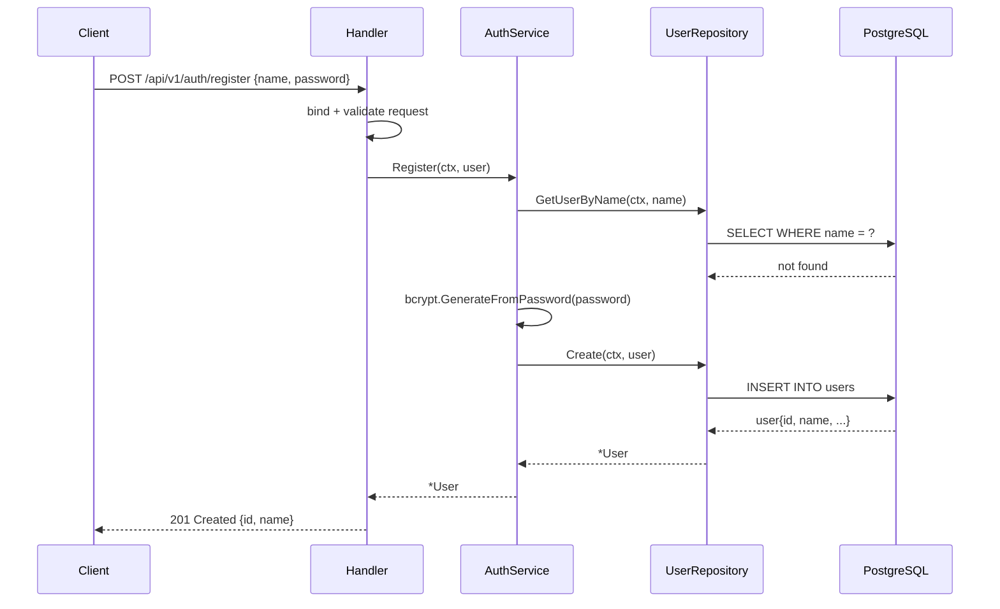
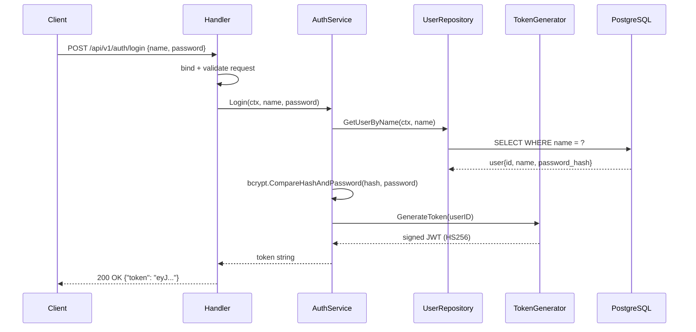
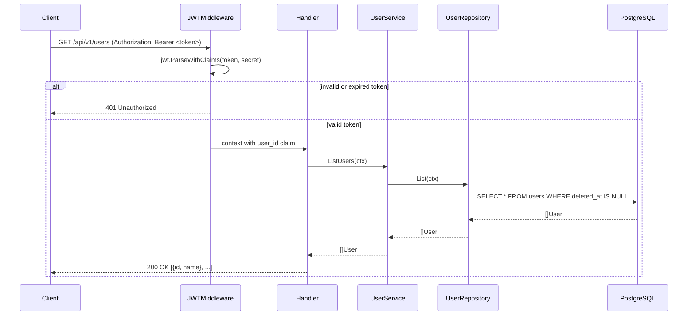

# Go Hexagonal Architecture Template

A production-ready template for building Go REST APIs using Hexagonal Architecture (Ports and Adapters pattern).

[](https://go.dev/)
[](https://codecov.io/gh/DeSouzaRafael/go-hexagonal-template)
[](https://goreportcard.com/report/github.com/DeSouzaRafael/go-hexagonal-template)
[](LICENSE)

## Overview

This template demonstrates a clean implementation of Hexagonal Architecture in Go. The business core has zero framework dependencies — HTTP, database, and JWT are external concerns that plug into the core through port interfaces. Any adapter can be swapped without touching business logic.

## Stack

| Concern | Library |
|---------|---------|
| HTTP framework | [Echo v4](https://echo.labstack.com/) |
| ORM | [GORM](https://gorm.io/) + PostgreSQL |
| Authentication | [golang-jwt/jwt v5](https://github.com/golang-jwt/jwt) |
| Validation | [go-playground/validator v10](https://github.com/go-playground/validator) |
| API documentation | [Swaggo](https://github.com/swaggo/swag) |
| Testing | [testify](https://github.com/stretchr/testify) + [go-sqlmock](https://github.com/DATA-DOG/go-sqlmock) |

## Architecture

The application is structured around three concentric layers. Dependencies always point inward — the core knows nothing about HTTP or databases.

```
+----------------------------------------------------------+
|                        Adapters                          |
|                                                          |
|   Web (Echo)              Database (GORM + PostgreSQL)   |
|   +-----------------+     +---------------------------+  |
|   | Handler         |     | UserRepository            |  |
|   | Router          |     | DatabaseAdapter           |  |
|   | JWTMiddleware   |     +---------------------------+  |
|   | TokenGenerator  |                                    |
|   | Validator       |                                    |
|   +-----------------+                                    |
|          |                          |                    |
|   +------+------------- Ports ------+---------+          |
|   |  AuthService    UserService    UserRepo   |          |
|   |  TokenGenerator DatabasePort              |          |
|   +---------+--------------------------+------+          |
|             |       Core             |                   |
|             |  +------------------+  |                   |
|             |  | AuthService      |  |                   |
|             +->| UserService      |<-+                   |
|                | Domain (User)    |                      |
|                | Sentinel Errors  |                      |
|                +------------------+                      |
+----------------------------------------------------------+
```

**Dependency rule:** `domain` imports nothing. `service` imports only `domain` and `port`. Adapters import `port`, never each other.

## Project Structure

```
.
├── cmd/app/
│   └── main.go                  # Entry point — wires config, DB, container, server
│
├── internal/
│   ├── container.go             # Manual DI — wires repos -> services -> handlers
│   ├── config/                  # Env-based configuration loading
│   ├── core/
│   │   ├── domain/              # Entities and sentinel errors (no external deps)
│   │   ├── port/                # Interfaces (contracts between layers)
│   │   └── service/             # Business logic, depends only on ports
│   └── adapters/
│       ├── database/
│       │   ├── database.go      # GORM + Postgres connection and lifecycle
│       │   └── repositories/    # Repository interface implementations
│       └── web/
│           ├── handler/         # HTTP handlers (bind -> validate -> service -> JSON)
│           ├── middleware/       # JWT authentication middleware
│           ├── router/          # Route registration
│           ├── token/           # JWT generation (implements TokenGenerator port)
│           └── validator/       # Echo validator adapter (go-playground/validator)
│
├── pkg/util/                    # Generic utilities (bcrypt wrapper, env helpers)
└── docs/                        # Auto-generated Swagger docs (do not edit)
```

## Request Flows

### Registration



### Login



### Authenticated Request



## Getting Started

### Prerequisites

- Go 1.25+
- PostgreSQL (or Docker)

### Local Setup

```bash
git clone https://github.com/DeSouzaRafael/go-hexagonal-template.git
cd go-hexagonal-template
go mod download
cp .env.example .env
```

Edit `.env`:

```env
APP_NAME=go-hexagonal-template
APP_ENV=development

WEB_PORT=8086
WEB_DOMAIN=localhost

JWT_SECRET=your-secret-key
JWT_EXPIRATION=86400

DB_HOST=localhost
DB_PORT=5432
DB_USER=postgres
DB_PASS=postgres
DB_NAME=hexagonal
DB_SSL_MODE=disable
DB_LOG_LEVEL=4
```

### Run

```bash
# With a real database
make run

# With in-memory mock (no database required)
go run cmd/app/main.go --mock-db
```

### Docker

Starts the application and a PostgreSQL instance without interfering with other running containers.

```bash
make docker-up       # Start app + Postgres
make docker-down     # Stop containers
make docker-restart  # Restart containers
```

> `AutoMigrate` only runs outside of `production` environment. Use a proper migration tool such as [golang-migrate](https://github.com/golang-migrate/migrate) for production deployments.

## API Reference

Base URL: `http://localhost:8086/api`

Interactive docs: `http://localhost:8086/swagger/index.html`

### Authentication

| Method | Path | Auth | Description |
|--------|------|------|-------------|
| POST | `/v1/auth/register` | — | Create a new account |
| POST | `/v1/auth/login` | — | Authenticate and receive a JWT |
| GET | `/v1/auth/profile` | Bearer | Return the authenticated user ID |

### Users

All endpoints require `Authorization: Bearer <token>`.

| Method | Path | Description |
|--------|------|-------------|
| GET | `/v1/users` | List all users |
| GET | `/v1/users?name=<name>` | Find user by name |
| GET | `/v1/users/:id` | Get user by ID |
| PUT | `/v1/users/:id` | Update user |
| DELETE | `/v1/users/:id` | Delete user (soft delete) |

## Testing

```bash
make test            # Run all tests
make test-verbose    # Verbose output with test names
make coverage        # Open HTML coverage report
make coverage-func   # Function-level coverage in terminal
```

## Development

### Regenerate Swagger docs

After modifying handler annotations, regenerate the docs directory:

```bash
swag init -g cmd/app/main.go -o docs --parseDependency --parseInternal
```

### Adding a new domain

1. Define the entity in `internal/core/domain/`
2. Define repository and service interfaces in `internal/core/port/`
3. Implement business logic in `internal/core/service/`
4. Implement the repository in `internal/adapters/database/repositories/`
5. Add HTTP handlers in `internal/adapters/web/handler/`
6. Register routes in `internal/adapters/web/router/`
7. Wire everything in `internal/container.go`

## License

MIT — see [LICENSE](LICENSE).
